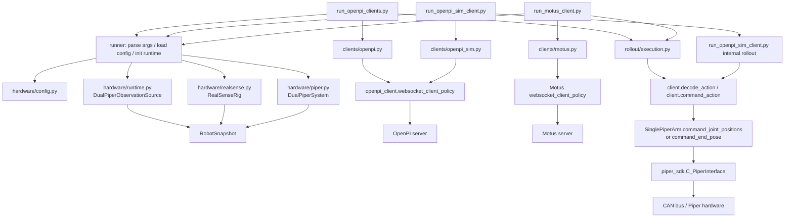
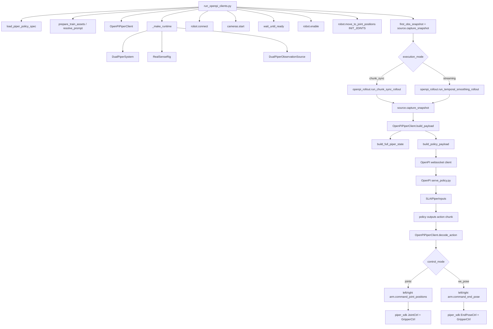
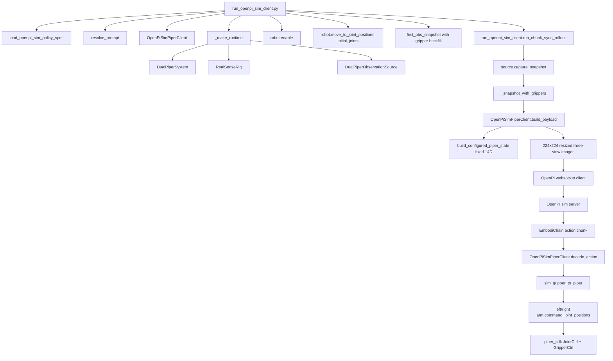
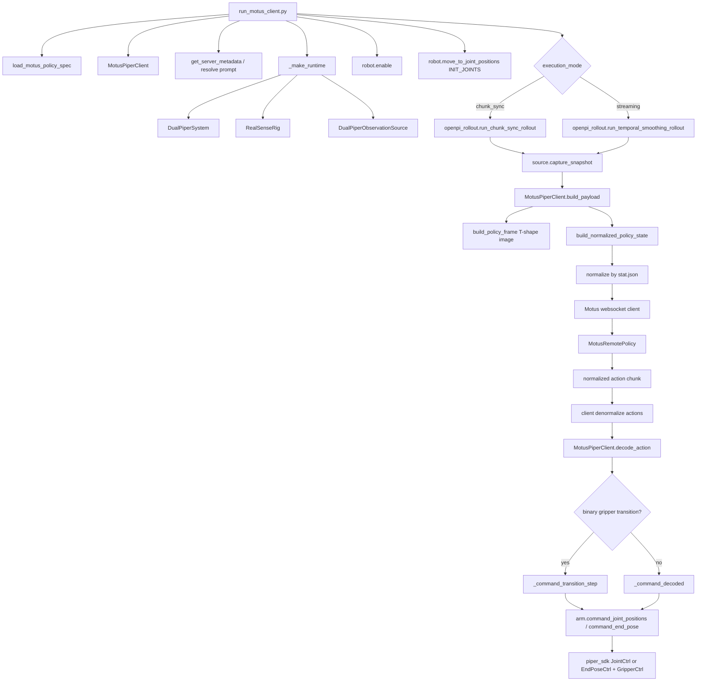
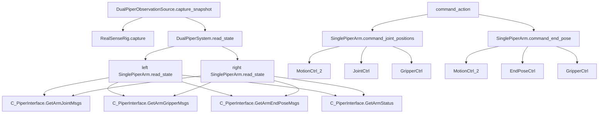

# Deploy Call Chain

这个目录现在只保留三条最外层真机部署入口：

- `run_openpi_clients.py`
- `run_openpi_sim_client.py`
- `run_motus_client.py`

它们共享同一套真机运行时骨架：

- `hardware/config.py`
- `hardware/runtime.py`
- `hardware/piper.py`
- `hardware/realsense.py`
- `hardware/schemas.py`
- `hardware/conversions.py`
- `hardware/constants.py`

## 1. 总体调用链

## 2. OpenPI 真机链

## 3. OpenPI Sim 真机链

## 4. Motus 真机链

## 5. 共享硬件层

## 6. 当前保留范围

当前 `challenge_deploy/` 只围绕下面这些文件保留：

- `run_openpi_clients.py`
- `run_openpi_sim_client.py`
- `run_motus_client.py`
- `configs/dual_piper_example.yaml`
- `docs/deploy_call_chain.md`
- `rollout/buffer.py`
- `hardware/config.py`
- `hardware/constants.py`
- `hardware/conversions.py`
- `rollout/assets.py`
- `clients/motus.py`
- `clients/openpi.py`
- `rollout/execution.py`
- `clients/openpi_sim.py`
- `hardware/piper.py`
- `hardware/realsense.py`
- `rollout/recording.py`
- `rollout/metrics.py`
- `hardware/runtime.py`
- `hardware/schemas.py`
