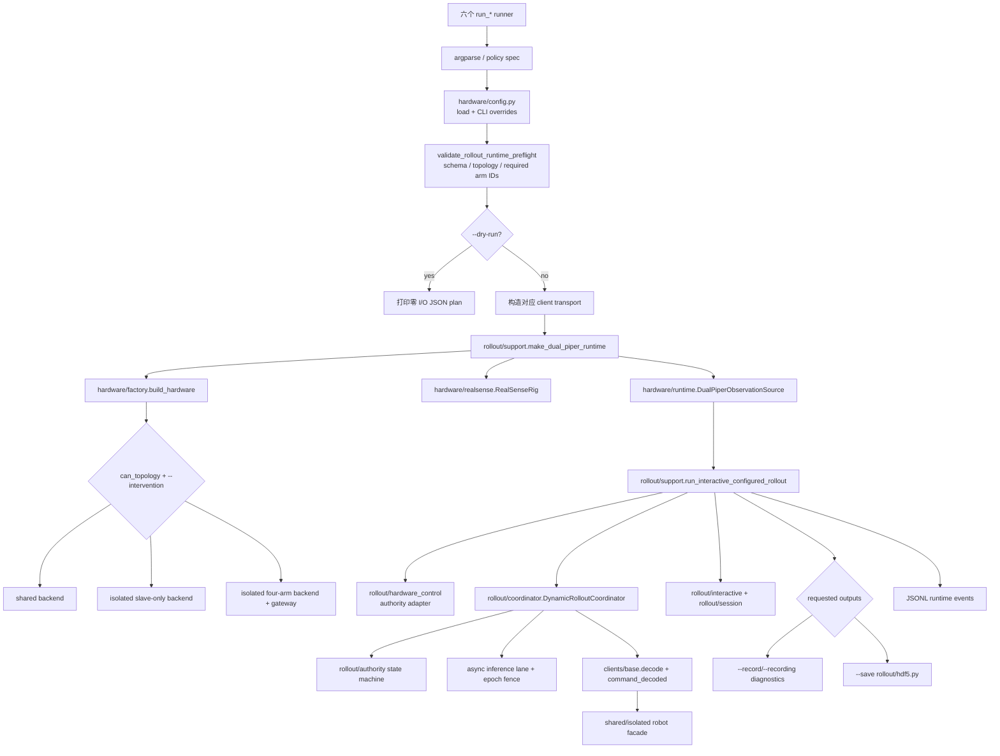
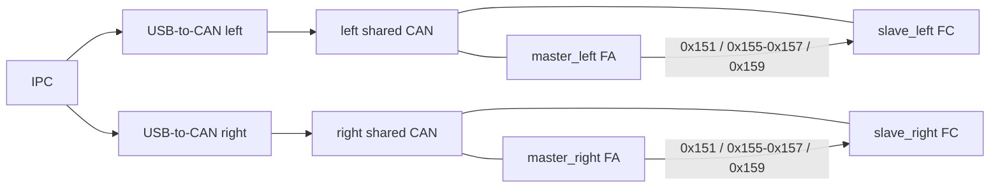
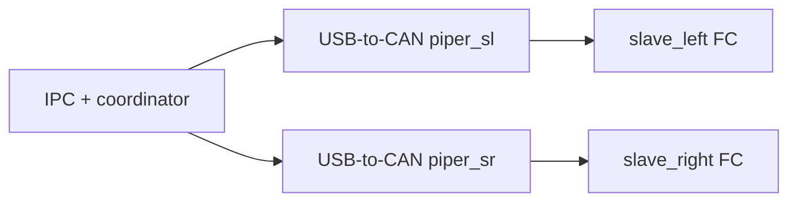
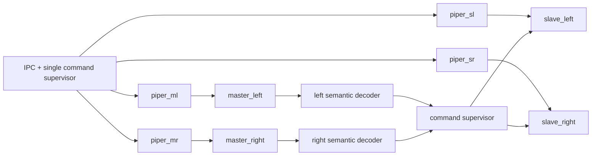
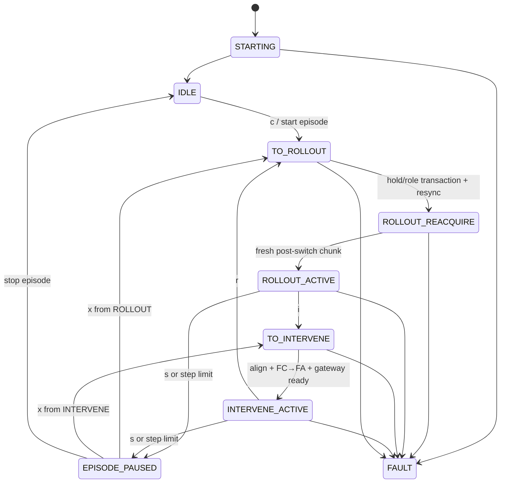
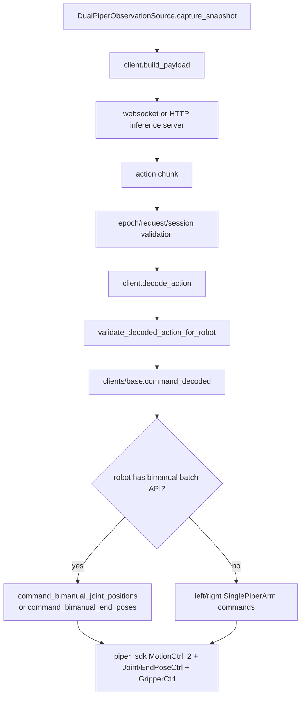

# Deploy Call Chain

六个真机入口保留原文件名和调用方式，但共享同一条 topology-aware rollout 骨架：

- `run_openpi_client.py`
- `run_xvla_client.py`
- `run_openpi_sim_client.py`
- `run_motus_client.py`
- `run_dreamzero_client.py`
- `run_fastwam_client.py`

master 固定指搭载示教器、由操作者拖动的臂；slave 固定指搭载夹爪、执行目标的
臂。公共 runtime 的 `robot.left/right` 始终是逻辑 slave。

## 1. 公共入口链

```mermaid
flowchart TD
    R[六个 run_* runner] --> ARG[argparse / policy spec]
    ARG --> CFG[hardware/config.py<br/>load + CLI overrides]
    CFG --> PURE[validate_rollout_runtime_preflight<br/>schema / topology / required arm IDs]
    PURE --> DRY{--dry-run?}
    DRY -->|yes| PLAN[打印零 I/O JSON plan]
    DRY -->|no| CLIENT[构造对应 client transport]
    CLIENT --> RT[rollout/support.make_dual_piper_runtime]
    RT --> FACTORY[hardware/factory.build_hardware]
    FACTORY --> BACKEND{can_topology + --intervention}
    BACKEND --> SHARED[shared backend]
    BACKEND --> SLAVE[isolated slave-only backend]
    BACKEND --> FOUR[isolated four-arm backend + gateway]
    RT --> CAM[hardware/realsense.RealSenseRig]
    RT --> SOURCE[hardware/runtime.DualPiperObservationSource]
    SOURCE --> SESSION[rollout/support.run_interactive_configured_rollout]
    SESSION --> CTRL[rollout/hardware_control<br/>authority adapter]
    SESSION --> COORD[rollout/coordinator.DynamicRolloutCoordinator]
    SESSION --> UI[rollout/interactive + rollout/session]
    COORD --> STATE[rollout/authority state machine]
    COORD --> INFER[async inference lane + epoch fence]
    COORD --> CMD[clients/base.decode + command_decoded]
    CMD --> ROBOT[shared/isolated robot facade]
    SESSION --> OUT{requested outputs}
    OUT --> REC[--record/--recording diagnostics]
    OUT --> HDF[--save rollout/hdf5.py]
    SESSION --> EVENT[JSONL runtime events]
```

`--dry-run` 在模型 server、CAN、相机、record window 和 HDF5 构造前返回。真实
运行先做纯配置 preflight，再通过 factory 选择一次 backend；runner 和具体 client
不散布 topology 分支。

## 2. Topology factory

| 配置 | 必需物理臂 | backend | gateway | 动态切换 |
|---|---:|---|---|---|
| `shared` | 当前两侧 shared CAN | `DualPiperSystem` | 无 | 不支持 |
| `isolated`，无 `--intervention` | `slave_left/right` | `IsolatedSlaveSystem` | 无 | 不支持 |
| `isolated --intervention` | 四臂 | `IsolatedFourArmSystem` | 双侧 semantic gateway | 支持 |

shared 与 `--intervention` 的组合会在构造 CAN 和相机前拒绝。isolated 普通
rollout 只验证、打开和控制两台 slave；master CAN 可以不存在。只有启用
`--intervention` 才要求四个 CAN 名与 USB serial 唯一，并构造四臂。

### shared golden path

```mermaid
flowchart LR
    IPC[IPC] --> UL[USB-to-CAN left]
    IPC --> UR[USB-to-CAN right]
    UL --> LB[left shared CAN]
    UR --> RB[right shared CAN]
    LB --- ML[master_left FA]
    LB --- SL[slave_left FC]
    RB --- MR[master_right FA]
    RB --- SR[slave_right FC]
    ML -->|0x151 / 0x155-0x157 / 0x159| SL
    MR -->|0x151 / 0x155-0x157 / 0x159| SR
```

同侧 master/slave 使用同一个 CAN 名。`piper_sdk.C_PiperInterface` 按 CAN 名
单例，因此静态遥操的 master-control 与 slave-feedback reader 是同一接收线程和
缓存上的两个逻辑视图。该分支保持已有连接、命令和断开顺序，不做 serial gate、
角色判断、`0x470` 写入或 host relay。

### isolated slave-only rollout

```mermaid
flowchart LR
    IPC[IPC + coordinator] --> CSL[USB-to-CAN piper_sl]
    IPC --> CSR[USB-to-CAN piper_sr]
    CSL --> SL[slave_left FC]
    CSR --> SR[slave_right FC]
```

模型目标只下发到两台 slave。公共 observation 和 client 仍读取
`robot.left/right`，不会构造 master placeholder。

### isolated four-arm dynamic runtime

```mermaid
flowchart LR
    IPC[IPC + single command supervisor] --> CML[piper_ml]
    IPC --> CMR[piper_mr]
    IPC --> CSL[piper_sl]
    IPC --> CSR[piper_sr]
    CML --> ML[master_left]
    CMR --> MR[master_right]
    CSL --> SL[slave_left]
    CSR --> SR[slave_right]
    ML --> GL[left semantic decoder]
    MR --> GR[right semantic decoder]
    GL --> SUP[command supervisor]
    GR --> SUP
    SUP --> SL
    SUP --> SR
```

ROLLOUT 中四台臂为 FC，`IsolatedFourArmSystem` 将同一个 canonical 双臂目标并发
提交给对应 master 和 slave，client observation 仍只使用 slave。INTERVENE 中
master 切到 FA，gateway 只发布完整、新鲜、skew 合格的控制帧组，由唯一
supervisor 提交到 FC slave。每个 generation 的首次成对提交还会以 slave seed
执行 7D no-jump gate（6 个关节和夹爪），失败会在任何 slave CAN 写入前同时
fault 两侧。角色先观察后设置；`0x470` 只在角色错误或不确定时按事务写入，
不周期刷新。切换不写 MIT PD、末端负载、安装方向、设零或 reset。

## 3. ROLLOUT↔INTERVENE 状态机

```mermaid
stateDiagram-v2
    [*] --> STARTING
    STARTING --> IDLE
    IDLE --> TO_ROLLOUT: c / start episode
    TO_ROLLOUT --> ROLLOUT_REACQUIRE: hold/role transaction + resync
    ROLLOUT_REACQUIRE --> ROLLOUT_ACTIVE: fresh post-switch chunk
    ROLLOUT_ACTIVE --> TO_INTERVENE: i
    TO_INTERVENE --> INTERVENE_ACTIVE: align + FC→FA + gateway ready
    INTERVENE_ACTIVE --> TO_ROLLOUT: r
    ROLLOUT_ACTIVE --> EPISODE_PAUSED: s or step limit
    INTERVENE_ACTIVE --> EPISODE_PAUSED: s or step limit
    EPISODE_PAUSED --> TO_ROLLOUT: x from ROLLOUT
    EPISODE_PAUSED --> TO_INTERVENE: x from INTERVENE
    EPISODE_PAUSED --> IDLE: stop episode
    STARTING --> FAULT
    ROLLOUT_REACQUIRE --> FAULT
    ROLLOUT_ACTIVE --> FAULT
    TO_INTERVENE --> FAULT
    INTERVENE_ACTIVE --> FAULT
    TO_ROLLOUT --> FAULT
```

状态机是唯一命令授权者。每次 episode 或控制权切换都会提升 epoch，并清空 action
buffer、旧 gripper transition、EE unwrap 和 client session 状态。推理 request、
response、pop 和 dispatch 都携带并复核 epoch/request/session；切换前仍在途的结果
即使晚到也不能提交，新 epoch 的首个 chunk 不与旧 chunk 平滑。

进入 INTERVENE 前 slave 先按 fresh feedback hold，master 在 FC 下通过现有路径
对齐，再事务性切到 FA；完整 master 帧族准备好后才开始转发。返回 ROLLOUT 时
先在帧组边界停止 gateway，slave hold，再将 master 切回 FC、对齐到 slave，最后
创建新 session 并等待切换后的 fresh observation。host 不设置 qpos/qvel、初始差值、
settle 或镜像误差阈值；机械运动限制由 Piper SDK/固件负责。

`streaming` 与 `chunk_sync` 都使用异步 inference worker，因此 `i/r/s/q` 不会被
网络调用阻塞：

- `streaming` 按配置 cadence 请求，对重叠 chunk 做 latency trim 和 temporal
  smoothing；
- `chunk_sync` 等现有 buffer 耗尽后再接收下一 chunk，不跨 chunk smoothing。

推理 timeout、断连或空 chunk 会在 `ROLLOUT_REACQUIRE` 中 hold 并重试；NaN、
Inf 或维度错误进入 latched `FAULT`。

## 4. Client 适配与命令提交

| runner | adapter | transport | action 特点 |
|---|---|---|---|
| OpenPI | `clients/openpi.py` | 本地 `clients.websocket_client_policy.WebsocketClientPolicy` | joints 或 EE |
| X-VLA | `clients/xvla.py` | 同一本地 websocket transport | 默认 EE |
| OpenPI-sim | `clients/openpi_sim.py` | 同一本地 websocket transport | 固定 14D joints+gripper01 |
| Motus | `clients/motus.py` | 同一本地 websocket transport | 归一化 chunk，joints 或 EE |
| DreamZero | `clients/dreamzero.py` | 同一本地 websocket transport | joints 或 EE |
| FastWAM | `clients/fastwam.py` | HTTP `POST /infer` | 14D joints+gripper action chunk |

六个 adapter 都进入同一个 coordinator，不再有 OpenPI-sim 私有 rollout loop，也不
从 runner 直接调用 legacy `rollout/execution.run_*_rollout`。

```mermaid
flowchart TD
    SNAP[DualPiperObservationSource.capture_snapshot] --> BUILD[client.build_payload]
    BUILD --> SERVER[websocket or HTTP inference server]
    SERVER --> CHUNK[action chunk]
    CHUNK --> FENCE[epoch/request/session validation]
    FENCE --> DECODE[client.decode_action]
    DECODE --> VALIDATE[validate_decoded_action_for_robot]
    VALIDATE --> COMMAND[clients/base.command_decoded]
    COMMAND --> BI{robot has bimanual batch API?}
    BI -->|yes| BATCH[command_bimanual_joint_positions<br/>or command_bimanual_end_poses]
    BI -->|no| SIDE[left/right SinglePiperArm commands]
    BATCH --> SDK[piper_sdk MotionCtrl_2 + Joint/EndPoseCtrl + GripperCtrl]
    SIDE --> SDK
```

isolated facade 用 bimanual API 并发提交两侧或四臂，避免 runner/client 自行拆分
拓扑。shared `DualPiperSystem` 沿用原左右 command 路径。

## 5. 交互、HDF5 与诊断输出

硬件、相机和模型 client 在多 episode session 中只连接一次：

- idle：`c` 开始，`q` 退出；有 writer 时 `k` 终止最老 writer；
- active：`s` 停止；动态模式下 `i`→INTERVENE、`r`→ROLLOUT；
- 达到步数上限：`x` 增加 `ceil(initial / 2)`，或 `s` 停止；`0` 为无限；
- `--save` 的正常 episode 停止后：`c` 保存 HDF5，`d` 丢弃 HDF5。

`--record/--recording` 是诊断视频、动作/状态 NPZ、frame1 和指标；`--save` 是训练
HDF5，两者独立。`--record-steps` 只限制诊断捕获，不停止控制或 HDF5。

rollout HDF5 只记录成功提交的 `ROLLOUT_ACTIVE`/`INTERVENE_ACTIVE` tick，
`/action` 是实际 canonical 目标，`/is_intervention` 与同一 action 对齐。writer pool
最多两个 `spawn` 进程，没有第三条等待队列；每个 writer 先写同目录唯一 `.tmp`，
成功后无覆盖地原子发布。

## 6. Fault 与物理安全边界

任一侧硬件故障或持续镜像误差会让整个 runtime 进入 `FAULT`，停止新模型命令、
gateway 和 pending action，不做单侧降级。仍可通信的 FC 臂会尽力按当前反馈
hold；INTERVENE 中 FA master 保持可回拖，slave 保持最后目标。实现不以
reset/disable 作为切换或故障处理手段。

软件不能让已经丢失 CAN 的臂接收新 hold，也不能在机械臂或电机断电后保证位置。
INTERVENE 中工控机或进程消失时，FA master 同样不能保证刚性保持。真机验收必须
从机械支撑下的单臂、单对空载开始。

## 7. 相关实现

- 配置与 topology：`hardware/config.py`、`hardware/factory.py`、
  `hardware/topology.py`
- shared/isolated hardware：`hardware/piper.py`、`hardware/isolated.py`
- semantic gateway：`hardware/linkage_gateway.py`
- observation/cameras：`hardware/runtime.py`、`hardware/realsense.py`
- authority/session：`rollout/authority.py`、`rollout/hardware_control.py`、
  `rollout/coordinator.py`、`rollout/interactive.py`、`rollout/session.py`
- rollout HDF5/events：`rollout/hdf5.py`、`rollout/events.py`
- client common path：`clients/base.py`、`clients/websocket_client_policy.py`
- static HDF5 teleop：`run_hdf5_teleop_collect.py`、`teleop/hdf5_teleop.py`
